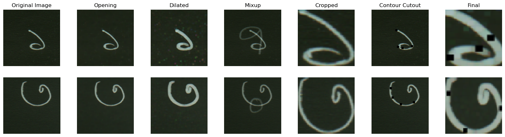
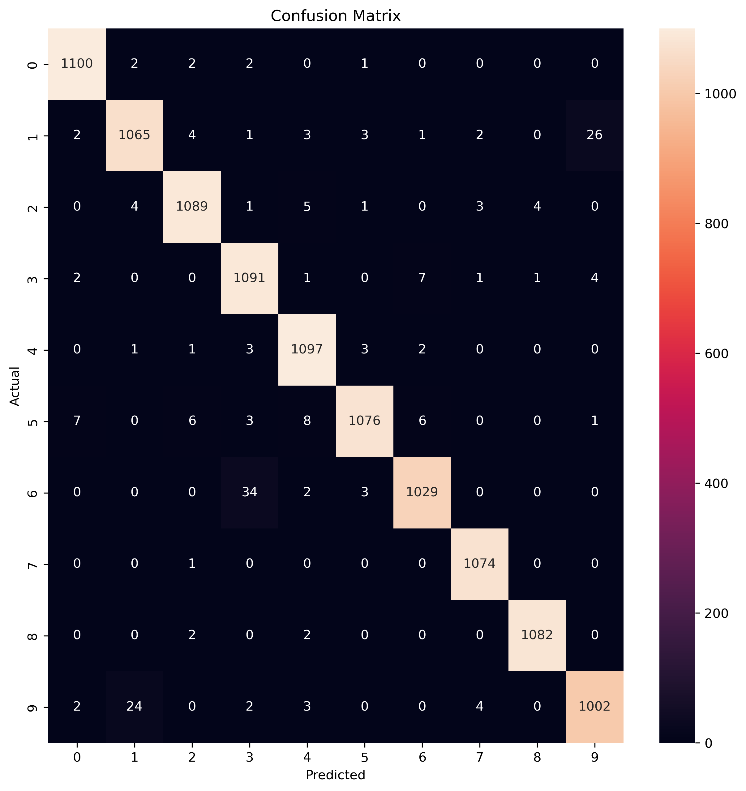

# Vectorized Convolutional Neural Network from Scratch

This repository contains the final assignment of CSE 472: Machine Learning Sessional offered by the CSE Department of BUET. [This repository](https://github.com/Najib-Haq/CSE-472-Machine-Learning) contains all the submissions for that course. <br>

The task is to build a vectorized version of a Convolutional Neural Network using only numpy without any deeplearning frameworks. Training and testing of the developed model is done on the [NumtaDB: Bengali Handwritten Digits](https://www.kaggle.com/datasets/BengaliAI/numta) dataset. The `trainig-a`, `training-b` and `training-c` folders are used for training and `training-d` is used for testing. A detailed report on the various experiments and final results can be found in [1705044_report.pdf](resources/1705044_report.pdf).


# Contents
## Model Blocks
The repository contains fully vectorized implementations for [Convolution](model/nn/Conv2d.py), [MaxPool](model/nn/MaxPool2d.py), [Fully Connected](model/nn/MaxPool2d.py) layers. Please see the `model` section of [config.yaml](config.yaml) file to understand how to build a model with these blocks and relevant arguments. 

## Augmentations
This repository contains various augmentation capabilities including Opening, Dilated, Mixup, BBox-crop and Contour-Cutout. Please see `augment` section of [config.yaml](config.yaml) for various parameters. Details can be found in the [report](resources/1705044_report.pdf).



## LR Scheduler
A simple implementation of the [ReduceLROnPlateau](https://pytorch.org/docs/stable/generated/torch.optim.lr_scheduler.ReduceLROnPlateau.html) is given. Please see `lr_scheduler` section of [config.yaml](config.yaml) for the parameters.


## WandB logging
Aside from normal text based logs, there is also support for `Weights and Bias` loggings. You would need to install `wandb` python package first and make a wandb project. In the [config.yaml](config.yaml) file, change `use_wandb` to `true` and change `project` and `entity` under `wandb` according to your project settings. You can just run your code and see live updates on your dashboard. So sit back and relax! 
All the logs of my training can be found [here](https://wandb.ai/nexh98/cse472_cnn_scratch?workspace=user-nexh98).


## Testing Your Code using PYTest
Different tests are developed using pytest for the testing of the different model blocks. The forward and backpropagation of each individual models are compared to those of similar blocks in pytorch. To run the tests:
```
%cd test
pytest
```

## Training
In order to run your model in the `numta` dataset, please download the dataset from [here](https://www.kaggle.com/datasets/BengaliAI/numta) to the `resources` directory. Alternatively, you can just set the `data_dir` to the dataset's location. Please go through the [config.yaml](config.yaml) file and change the values accordingly. To run the training script, first install the packages from requirements.txt and run `python train.py`


## Inference
Infer any directory of images using your developed model by changing `checkpoint_path` in the [config.yaml](config.yaml) file and executing `python test.py $test_directory`. A pretrained model is available [here](resources/1705044_model.npy). If you have a ground truth csv, enter the path in `gt_csv` to get accuracy, f1 scores and a confusion matrix of the prediction. This is the confusion matrix for `training-d` folder of the dataset:


## Results
The final F1 macro scores of the model are as follows:

Validation | Testing (training-d) | Testing (In evaluation)
--- | --- | ---
0.9769 | 0.98133 | 0.9783

## Resources
Additionally [Pseudo Labels1](resources/nd_removed_train_a.csv), [Pseudo Labels2](resources/nd_removed_train_c.csv), [Pretrained Checkpoint](resources/1705044_model.npy) and [Report](resources/1705044_report.pdf) are given under the `resources` folder. The notebook which trained the pretrained checkpoint can be found [here](https://www.kaggle.com/nexh98/cse-472-offline4-bbox-model3-pseudo-p2).
